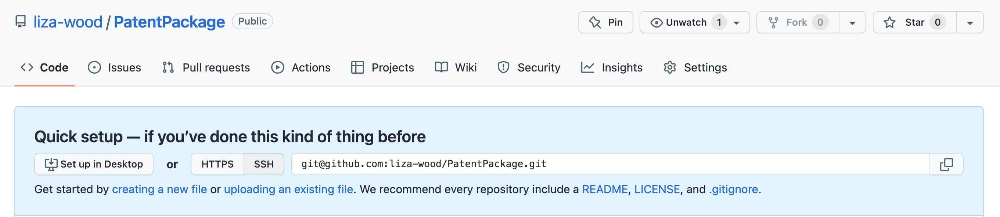

# Create a package {-}

Note: This tutoial is derived from [Fong Chun Chan's Blog](https://tinyheero.github.io/jekyll/update/2015/07/26/making-your-first-R-package.html)  

### Setting up  

First, make sure you have the two packages we'll need to build a package:  

```
library(roxygen2)
library(devtools)
```

In an empty project in RStudio, use devtools function to build you a package template, putting your package name in quotation marks:  

```
devtools::create("PatentPackage")
```

This template includes a couple bits, the two we'll focus on first are the `DESCRIPTION` page and the `R/` folder. In the `DESCRIPTION` folder there is a template for package information. Devtools makes it easy for you to just fill in the prompts. I've also added 

```
Package: PatentPackage
Title: Reads In US Patent Data
Version: 0.0.0.9000
Authors@R: 
    person("Liza", "Wood", , "belwood@ucdavis.edu", role = c("aut", "cre"))
Description: Here I will describe what this package does
License: `use_mit_license()`, `use_gpl3_license()` or friends to pick a
    license
Encoding: UTF-8
Roxygen: list(markdown = TRUE)
RoxygenNote: 7.2.1
Imports: 
    lubridate
Depends: 
    R (>= 2.10)
```

### Writing and annotating your function(s)  

Inside the `R/` folder is there the functions will go. Open up an R script and paste in your function. This is our function from last week:

```
read_patents <- function(file_dir){
  patents <- do.call("rbind", 
                     lapply(list.files(file_dir, full.names = T),
                            function(x){
    df <- read.csv(x)
    df$App_Date <- ymd(as.character(df$App_Date))
    df$Issue_Date <- ymd(as.character(df$Issue_Date))
    return(df)}))
  return(patents)
}
```

We also need to add documentation so that we can have a help file for our function. We do this using roxygen2 notation by start lines with the `#'` symbols and adding in certain notation arguments, which starts with `@` signs. The basics are described in the [`roxygen2` vigenette](https://cran.r-project.org/web/packages/roxygen2/vignettes/rd.html). For instance:

```
#' Read US Patent Documentation
#'
#' Reads in csv files generates by the `patentr` package which downloans US patent
#' records by the week, alters their date columns to date formats, then binds them
#' into one data frame.
#'
#' @param file_dir Folder where USPTO csv files are stored, downloaded via `patentr` package
#'
#' @return A data frame of patents binded together
#'
#' @examples patents <- read_patents(file_dir = "patent_files/")
#'
#' @import lubridate
#'
#' @export
```

Include the notation at the start of your script, above the function. Then save your R scripts as the name of your function inside the R folder. Make sure you are in your Rproject, then to update your function documentation, run:

```
devtools::document()
```

This generates a `man/` folder that stores the documenation.

### Making your package available  

Now we want to link your package to a GitHub repository. In GitHub, create a new repository with your package name, with no other templates. It should then appear as below.



Then inside your empty RStudio space that you have been building the package, link the local project to the GitHub repository using the following lines in the Terminal, replacing the GitHub repo directory with the link to your directory.

```
git init
git add .
git commit -m "Setting up package to GitHub"
git remote add origin https://github.com/liza-wood/PatentPackage
git push -u -f origin master
```

Now this package lives on GitHub: https://github.com/liza-wood/PatentPackage. Which also means we can all use it now by installing it from GitHub:

```{r}
devtools::install_github("liza-wood/PatentPackage")
```

```{r}
library(PatentPackage)
?read_patents()
```

And you can download the data stored in this workshop repository, the patents for 52 weeks from 1977, to trial the function. First download the data here:


Then give it a try once you've installed the package: 
```{r}
patents <- read_patents("data/")
head(patents)
```

